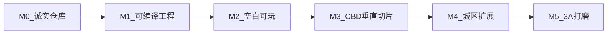

# 3A 路线图（ROADMAP）

> **目标**: 以广州市为背景的开放世界，体验方向对标 GTA / 赛博朋克式自由探索，质量目标为可验证的 **3A（AAA）**，而不是口头「4A+」。  
> **现状**: 见 [REALITY_STATUS.md](REALITY_STATUS.md)。**M0（诚实仓库）文档层已完成**；M1 起需本机引擎。  
> **平台默认**: Apple Silicon Mac；引擎版本以 Epic **正式发布且本机可安装** 的 UE5 为准，禁止把未验证版本号写成「已交付」。

---

## 总原则

1. **验收看游玩与测量**，不看 checklist 勾选或优化日志条数。  
2. **先切片，后全城**。首个城区默认：**天河 / 珠江新城 CBD 一小块**（步行尺度街区）。  
3. **缺美术就标缺失**，不生成假 `.uasset` 冒充进度。  
4. **YAGNI**: 未到对应里程碑，不扩职业系统、联机 64 人、全城 OSM 等。

---

## M0 — 诚实仓库（本次）

| | |
|--|--|
| **目标** | 新人读 README 不会以为已有可玩广州 |
| **依赖** | 仅 Git 仓库 |
| **交付** | `REALITY_STATUS.md`、本路线图、诚实 README、纠正夸大文档 / `.uproject` 描述 |
| **不做** | 假地图、假编译证明、新玩法系统 |
| **DoD** | 文档开篇写明不可玩 / 无 Content / 大量 stub；配置勾选 ≠ 3A 完成 |

**状态**: **已完成**（诚实文档与状态表已入库）。

---

## M1 — 可编译工程

| | |
|--|--|
| **目标** | 本机用真实 UE5 打开工程，无致命插件错误 |
| **依赖** | Apple Silicon Mac；已安装的正式版 UE5；Xcode；按需编译或暂时禁用 Jolt/SoLoud |
| **交付** | 锁定 `EngineAssociation` 到本机真实版本；第三方库可链接 **或** 明确 `Enabled: false` 并文档说明；编辑器可启动 |
| **不做** | 宣称 Metal 4.3 / 未发布 SDK「已全部就绪」；全城美术 |
| **DoD** | `UnrealEditor` 打开 `.uproject` 无致命报错；能进入空关卡或创建默认关卡 |

---

## M2 — 空白可玩

| | |
|--|--|
| **目标** | 最小第三人称可玩循环 |
| **依赖** | M1；基础 Character 网格/动画（可用引擎模板） |
| **交付** | `Content/Maps` 下最小关卡；移动 + 相机；本地存档读档 |
| **不做** | 天气全套、Mass 万人、载具物理打磨、联机 |
| **DoD** | 能走进盒子/平面世界并保存读档；录一段操作视频即可验收 |

---

## M3 — CBD 垂直切片（3A 原型门槛）

| | |
|--|--|
| **目标** | 「这像广州 CBD 一小块，能逛能开」 |
| **依赖** | M2；街区尺度建筑/道路（自建、采购或合法扫描）；少量 NPC/车资产 |
| **交付** | 天河/珠江新城步行尺度街区；日夜 + **至少一种**天气；少量行人/交通；**一辆**可驾驶载具；现有 `GZGameMode` 等草稿接到真关卡 |
| **不做** | 八区全开、12k Mass、完整任务线、EOS 联机 |
| **DoD** | 5–10 分钟自由游玩录像；目标 Mac 上帧率可接受（自定底线并写进测试记录）；无致命流送/崩溃 |

**通过 M3 才算进入「开放世界原型」；此前不得自称 3A 游戏。**

---

## M4 — 城区扩展

| | |
|--|--|
| **目标** | 多区无缝，World Partition 稳定 |
| **依赖** | M3；分区美术与 HLOD；导航烘焙流程 |
| **交付** | 按优先级扩展：骑楼旧城 → 海珠/沿江 → 大学城等（可调整顺序，但须逐区验收）；跨区流送 |
| **不做** | 一上来 OSM 20km 全塞；未测就开 12k AI |
| **DoD** | 跨区步行/驾车无致命卡死；流送卡顿有测量数据；每新区有独立验收录像 |

---

## M5 — 3A 打磨

| | |
|--|--|
| **目标** | 可称为 3A 体验的深度与完成度 |
| **依赖** | M4；音频包；玩法设计；可选真实 EOS |
| **交付** | 任务/通缉/职业等玩法深度（按设计裁剪）；空间音频；画质与性能档位实测；联机若做则非 stub |
| **不做** | 用配置清单 100% 代替实测；「4A+」营销话术替代验收 |
| **DoD** | 下文 **3A 验收清单** 逐项实测通过 |

---

## 3A 验收清单（仅 M5；须实测）

下列任一项未测，不得宣称达到 3A。

| # | 验收项 | 通过标准 |
|---|--------|----------|
| A1 | 自由探索 | 连续 30+ 分钟在已开放城区游玩无崩溃 |
| A2 | 交通与行人 | 至少一区有稳定车流/人流，行为不明显穿模失控 |
| A3 | 载具 | 至少 2 类载具可开，物理手感可重复录制对比 |
| A4 | 昼夜天气 | 日夜循环 + ≥3 种天气，路面/光照有可见差异 |
| A5 | 任务或活动 | ≥1 条完整任务链或等价开放活动闭环 |
| A6 | 音频 | 环境/车辆/UI 有基本空间层次，无持续静音或爆音 |
| A7 | 性能档 | M 系列至少两档画质预设，有帧时间记录 |
| A8 | 存档 | 本地存档可靠；若宣称云存档则 EOS 非 stub |
| A9 | 内容合法 | 发布用资产具备授权说明（学习原型可标注未授权范围） |

---

## 引擎与版本策略

| 写法 | 允许？ |
|------|--------|
| 「目标：UE5.x + Metal，待本机锁定」 | 允许 |
| 「EngineAssociation 已与本机安装版本一致，编辑器可开」 | M1 后允许 |
| 「UE 5.8 / Metal 4.3 / SoLoud 2026 已全部交付」且未实测 | **禁止** |
| 把 `DefaultEngine.ini` CVar 勾选当成画质验收 | **禁止** |

真实开工时：安装 Epic 当前支持 Apple Silicon 的最新正式版 UE5 → 改 `.uproject` / 文档中的关联版本 → 再进 M1 DoD。

---

## 建议工作顺序（无引擎时）

1. 保持 M0 文档为唯一「完成度」来源。  
2. 准备本机：装 UE → 执行 M1。  
3. 用引擎模板快速过 M2，再投入 CBD 美术做 M3。  
4. 只有 M3 通过后，再谈八区、Mass 万人、联机。

---

## 里程碑状态总表

| 里程碑 | 状态 |
|--------|------|
| M0 诚实仓库 | **已完成** |
| M1 可编译工程 | 未开始（需本机 UE） |
| M2 空白可玩 | 未开始 |
| M3 CBD 垂直切片 | 未开始 |
| M4 城区扩展 | 未开始 |
| M5 3A 打磨 | 未开始 |
