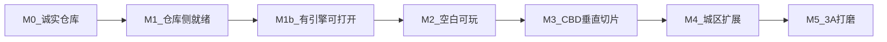

# 3A 路线图（ROADMAP）

> **目标**: 以广州市为背景的开放世界，体验方向对标 GTA / 赛博朋克式自由探索，质量目标为可验证的 **3A（AAA）**，而不是口头「4A+」。  
> **现状**: 见 [REALITY_STATUS.md](REALITY_STATUS.md)。**M0 已完成**；**M1（仓库侧）** 见本文件。  
> **引擎**: 目标钉 **UE5.8**；**UE6 发布后整仓替换**（[ENGINE_STRATEGY.md](ENGINE_STRATEGY.md)）。  
> **免费栈**: [TECH_STACK_FREE.md](TECH_STACK_FREE.md)。  
> **工作模式**: 维护者本机可能无法安装引擎；**GitHub = 唯一免费代码缓存**。游玩类验收仅在有 UE5.8 的环境执行（M1b 起）。  
> **无引擎可推进**: 剧情 / macOS 27 UI / 广州区划数据 — [STORY_BIBLE.md](STORY_BIBLE.md) · [Data/GUANGZHOU_DISTRICTS.md](Data/GUANGZHOU_DISTRICTS.md) · [M2_PREP_CHECKLIST.md](M2_PREP_CHECKLIST.md)。

---

## 总原则

1. **验收看游玩与测量**，不看 checklist 勾选或优化日志条数。  
2. **先切片，后全城**。首个城区默认：**天河 / 珠江新城 CBD 一小块**（步行尺度街区）。  
3. **缺美术就标缺失**，不生成假 `.uasset` 冒充进度。  
4. **YAGNI**: 未到对应里程碑，不扩职业系统、联机 64 人、全城 OSM 等。  
5. **无本机引擎不等于停更**：可继续提交 Source / Config / Docs；不得伪造编译通过。

---

## M0 — 诚实仓库

| | |
|--|--|
| **目标** | 新人读 README 不会以为已有可玩广州 |
| **依赖** | 仅 Git 仓库 |
| **交付** | `REALITY_STATUS.md`、本路线图、诚实 README、纠正夸大文档 |
| **不做** | 假地图、假编译证明、新玩法系统 |
| **DoD** | 文档开篇写明不可玩 / 无 Content / 大量 stub；配置勾选 ≠ 3A 完成 |

**状态**: **已完成**。

---

## M1 — 仓库侧就绪（无本机引擎版）

| | |
|--|--|
| **目标** | 仓库可当作「UE5.8 目标工程 + 免费栈」完整缓存，供他机/未来环境使用 |
| **依赖** | 仅 Git / GitHub（不要求维护者本机安装 UE） |
| **交付** | `TECH_STACK_FREE.md`、`ENGINE_STRATEGY.md`；`EngineAssociation=5.8`；Jolt/SoLoud **默认 Disabled**；README/本路线图已反映远程模式 |
| **不做** | 宣称本机或 CI 已用 UE5.8 编译通过；假 Content |
| **DoD** | 上述文档入库；`.uproject` 钉 5.8 且第三方包装默认关闭；新人能从 README 找到免费栈与 UE6 替换策略 |

**状态**: 本变更完成后标为 **已完成**。

---

## M1b — 有引擎环境可打开

| | |
|--|--|
| **目标** | 在安装了 **UE5.8** 的机器（或等价云环境）上打开工程，无致命插件错误 |
| **依赖** | UE5.8；Xcode（Mac）；克隆本仓库 |
| **交付** | 编辑器可启动；空关卡或创建默认关卡；按需再启用可选插件 |
| **不做** | 在无引擎机器上勾选本里程碑；宣称全城可玩 |
| **DoD** | `UnrealEditor` 打开 `.uproject` 无致命报错 |

**状态**: 未开始（等待有 UE5.8 的环境）。

---

## M2 — 空白可玩

| | |
|--|--|
| **目标** | 最小第三人称可玩循环 |
| **依赖** | **M1b**；基础 Character 网格/动画（可用引擎模板） |
| **交付** | `Content/Maps` 下最小关卡；移动 + 相机；本地存档读档 |
| **不做** | 天气全套、Mass 万人、载具物理打磨、联机 |
| **DoD** | 能走进盒子/平面世界并保存读档；录一段操作视频即可验收 |

---

## M3 — CBD 垂直切片（3A 原型门槛）

| | |
|--|--|
| **目标** | 「这像广州 CBD 一小块，能逛能开」 |
| **依赖** | M2；街区尺度建筑/道路（Blender / Megascans 等按免费栈获取）；少量 NPC/车资产 |
| **交付** | 天河/珠江新城步行尺度街区；日夜 + **至少一种**天气；少量行人/交通；**一辆**可驾驶载具（Chaos Vehicles）；草稿系统接到真关卡 |
| **不做** | 八区全开、宣称万人 Mass、完整任务线、EOS 联机 |
| **DoD** | 5–10 分钟自由游玩录像；目标硬件上帧率可接受；无致命流送/崩溃 |

**通过 M3 才算进入「开放世界原型」；此前不得自称 3A 游戏。**

---

## M4 — 城区扩展

| | |
|--|--|
| **目标** | 多区无缝，World Partition 稳定 |
| **依赖** | M3；分区美术与 HLOD；导航烘焙；可用 GDAL+PDAL 预处理 OSM/点云 |
| **交付** | 按优先级扩展：骑楼旧城 → 海珠/沿江 → 大学城等；跨区流送 |
| **不做** | 一上来 OSM 20km 全塞；未测就开超大 Mass |
| **DoD** | 跨区步行/驾车无致命卡死；流送有测量数据；每新区有验收录像 |

---

## M5 — 3A 打磨

| | |
|--|--|
| **目标** | 可称为 3A 体验的深度与完成度 |
| **依赖** | M4；音频包；玩法设计；可选真实 EOS / 可选本地 LLM |
| **交付** | 任务/通缉等玩法深度（按设计裁剪）；空间音频（UE 内置优先）；画质与性能档实测 |
| **不做** | 用配置清单代替实测；「4A+」营销话术替代验收 |
| **DoD** | 下文 **3A 验收清单** 逐项实测通过 |

---

## 3A 验收清单（仅 M5；须实测）

下列任一项未测，不得宣称达到 3A。

| # | 验收项 | 通过标准 |
|---|--------|----------|
| A1 | 自由探索 | 连续 30+ 分钟在已开放城区游玩无崩溃 |
| A2 | 交通与行人 | 至少一区有稳定车流/人流，行为不明显穿模失控 |
| A3 | 载具 | 至少 2 类载具可开，物理手感可重复录制对比 |
| A4 | 昼夜天气 | 日夜循环 + ≥3 种天气，路面/光照有可见差异 |
| A5 | 任务或活动 | ≥1 条完整任务链或等价开放活动闭环 |
| A6 | 音频 | 环境/车辆/UI 有基本空间层次，无持续静音或爆音 |
| A7 | 性能档 | 至少两档画质预设，有帧时间记录 |
| A8 | 存档 | 本地存档可靠；若宣称云存档则 EOS 非 stub |
| A9 | 内容合法 | 发布用资产具备授权说明（学习原型可标注未授权范围） |

---

## 引擎与版本策略（摘要）

| 写法 | 允许？ |
|------|--------|
| 「目标引擎 UE5.8；代码缓存在 GitHub」 | 允许 |
| 「M1 仓库侧文档与插件策略已就绪」 | M1 后允许 |
| 「M1b：UE5.8 编辑器已打开无致命错误」 | **仅有引擎环境实测后**允许 |
| 「UE5.8 / 全栈已交付可玩」且未过 M3 | **禁止** |
| 把 CVar 勾选当成画质验收 | **禁止** |
| 「UE6 已替换完成」 | 仅整仓迁移并重跑验收后允许 |

完整说明：[ENGINE_STRATEGY.md](ENGINE_STRATEGY.md)。

---

## 建议工作顺序

1. **无引擎**：保持文档/剧情/JSON/Mac Mock；跟 [HANDOFF.md](handoff/HANDOFF.md)。  
2. **有 UE5.8**：按 [M2_RUNBOOK.md](M2_RUNBOOK.md) 执行 M1b → M2 → 再 M3。  
3. 只有 M3 通过后，再谈八区、大规模 Mass、联机。  
4. **UE6 发布后**：按 ENGINE_STRATEGY 整仓替换，再重验 M1b–M3。

---

## 里程碑状态总表

| 里程碑 | 状态 |
|--------|------|
| M0 诚实仓库 | **已完成** |
| M1 仓库侧就绪 | **已完成**（免费栈 + 引擎策略 + 插件默认禁用） |
| M1b 有引擎可打开 | 未开始（需 UE5.8 环境） |
| M2 空白可玩 | 未开始 |
| M3 CBD 垂直切片 | 未开始 |
| M4 城区扩展 | 未开始 |
| M5 3A 打磨 | 未开始 |
